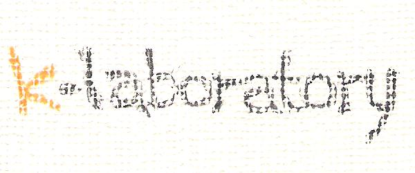

# ПАТЕНТНАЯ ДЕКЛАРАЦИЯ И ОПИСАНИЕ АКТИВА

**Наименование актива:** K-Laboratory Underwater Robotics Platform (KURP)
**Владелец/Изобретатель:** Leonidy431 / K-Laboratory, Inc.
**Статус:** Proprietary Technology / Trade Secret
**Классификация актива:** Программное обеспечение (Software), Робототехника (Robotics), Подводные системы (Underwater Systems)

---

## 1. Резюме Актива (Asset Executive Summary)

Данный репозиторий представляет собой **нематериальный цифровой актив**, являющийся веб-платформой для управления и мониторинга подводных робототехнических систем (ROV). Ценность актива заключается в интеграции аппаратного обеспечения ROV "Schneewittchen" с программными решениями для удаленного управления и телеметрии.

Продукт сочетает:
- Веб-интерфейс управления подводными аппаратами
- Систему визуализации данных с ROV (видео, сенсоры)
- Базу знаний по океанологии (Oceanology Infoprysm)
- Корпоративную платформу NGO Club для партнерств

---

## 2. Описание Изобретения (Patent Description)

### Область техники
Изобретение относится к системам дистанционного управления подводными аппаратами (ROV - Remote Operated Vehicles), веб-интерфейсам телеметрии и образовательным платформам в области морских технологий.

### Проблема
Существующие решения для управления ROV требуют специализированного ПО, установленного локально. Операторы ограничены физическим присутствием у контроллера. Отсутствует единая платформа, объединяющая:
- Управление ROV
- Базы данных океанологии
- Партнерские программы
- Образовательные материалы

### Решение
Разработана веб-платформа K-Laboratory, реализующая:

1. **Веб-интерфейс ROV "Schneewittchen":**
   - Глубина погружения: до 300 метров
   - 5 горизонтальных двигателей по 1500 г каждый
   - HD камеры 1080i с LED освещением 4x25W
   - Цифровой компас и датчик глубины
   - Ручной/автоматический контроль глубины

2. **Система Oceanology Infoprysm:**
   - Поисковый индекс морских данных
   - Интеграция с внешними базами данных
   - API для научных партнеров

3. **Кросс-платформенная совместимость:**
   - Работа в браузере без установки ПО
   - Поддержка мобильных устройств
   - Интеграция с BlueOS и навигационными системами

---

## 3. Коммерческая и Стратегическая Ценность (Company Asset Valuation)

### 3.1. Рыночный потенциал (Market Application)

| Сектор | Применение |
|--------|------------|
| **Научные исследования** | Океанографические экспедиции, исследование морского дна |
| **Нефтегазовая отрасль** | Инспекция подводных трубопроводов и платформ |
| **Археология** | Подводные раскопки и документирование |
| **Оборона и безопасность** | Обследование портов, поиск мин |
| **Аквакультура** | Мониторинг рыбных ферм |
| **Образование** | Курсы по ROV, соревнования (ROV Competition 2010) |

### 3.2. Партнерская сеть

Ассоциированные компании:
- **ngoclub.org** - Платформа НКО сотрудничества
- **prvision Co.** - Визуальные технологии
- **exopoliticsasia.com** - Азиатские проекты
- **tai-rus.com** - Российско-тайваньское партнерство
- **prodiving.cn** - Китайский рынок дайвинга

### 3.3. Технологический суверенитет
- Полный контроль над исходным кодом
- Независимость от облачных провайдеров
- Возможность развертывания на собственных серверах
- Отсутствие внешних трекеров (кроме опционального Google Analytics)

### 3.4. Интеллектуальная собственность (IP)
* **Авторское право на код:** Веб-интерфейс, система навигации, интеграционные модули
* **Товарный знак:** "K-Laboratory", "Schneewittchen", "Oceanology Infoprysm"
* **Ноу-хау:** Протоколы связи с ROV, алгоритмы стабилизации видео под водой

---

## 4. Технические характеристики ROV "Schneewittchen"

```
+----------------------------------+-----------------------------------+
| Параметр                         | Значение                          |
+----------------------------------+-----------------------------------+
| Максимальная глубина             | 300 метров                        |
| Скорость                         | 0-2 м/сек (0-3.89 узлов)          |
| Длина кабеля                     | до 600 метров                     |
| Диаметр кабеля                   | 8 мм                              |
| Температурный диапазон           | 0-35°C                            |
| Освещение                        | 4x25W LED                         |
| Камера                           | 540 линий, 0.3/0.002 lux          |
| Видео стандарт                   | PAL/NTSC, 2x HD 1080i             |
| Габариты                         | 400x250x250 мм                    |
| Вес                              | 5.5 кг (в воздухе)                |
| Питание                          | 220-240V AC 50Hz / 400V DC        |
| Потребление                      | 500W (без опций)                  |
| Гарантия                         | 2 года                            |
+----------------------------------+-----------------------------------+
```

### Опции
- Манипулятор
- Задняя камера
- Лазерные указатели
- Сонар RovBuilder RAY
- LCD 15"
- Подводный микрофон

---

## 5. Формула Изобретения (Claims)

1. **Веб-платформа управления ROV**, содержащая модуль визуализации телеметрии, модуль управления двигателями и модуль записи видео, отличающаяся тем, что все функции доступны через стандартный веб-браузер без установки дополнительного ПО.

2. **Система "Oceanology Infoprysm"**, представляющая собой поисковый индекс океанологических данных с возможностью интеграции внешних источников через API, работающая в связке с ROV для привязки данных к географическим координатам.

3. **Метод интеграции NGO Club**, позволяющий объединять некоммерческие организации для совместного использования ROV-ресурсов, распределения времени доступа и совместного финансирования экспедиций.

4. **Программно-аппаратный комплекс ROV "Schneewittchen"**, включающий подводный аппарат с 5 двигателями, HD-видеосистему и веб-контроллер, отличающийся малыми габаритами (5.5 кг) при глубине погружения до 300 метров.

---

## 6. Рекомендации по улучшению кода (Code Improvement Tips)

Анализ по 12 параметрам качества кода выявил следующие приоритетные улучшения:

### 6.1. HTML Validity (Валидность разметки)
**Проблема:** Использован устаревший DOCTYPE XHTML 1.0 Transitional, смешанный lang="ja" (японский) при англоязычном контенте.
```html
<!-- Было -->
<!DOCTYPE html PUBLIC "-//W3C//DTD XHTML 1.0 Transitional//EN">
<html xmlns="http://www.w3.org/1999/xhtml" lang="ja">

<!-- Рекомендуется -->
<!DOCTYPE html>
<html lang="en">
```

### 6.2. Semantic Markup (Семантическая разметка)
**Проблема:** Вся разметка на устаревших `<table>` вместо семантических тегов.
**Рекомендация:** Заменить табличную верстку на:
- `<header>` для шапки
- `<nav>` для меню
- `<main>` для контента
- `<footer>` для подвала
- `<article>`, `<section>` для структуры

### 6.3. CSS Architecture (Архитектура стилей)
**Проблема:** Повторяющийся код (font-family объявлен 15+ раз), отсутствие CSS-переменных.
```css
/* Рекомендуется добавить в начало */
:root {
    --font-primary: verdana, arial, helvetica, sans-serif;
    --color-text: #969393;
    --color-accent: #ffb200;
    --color-border: #dbddde;
}
```

### 6.4. Security (Безопасность)
**Проблема:** HTTP-ссылки на внешние ресурсы, email в meta-тегах.
```html
<!-- Проблема -->
<META NAME="email" CONTENT="monstr@dot.lv">
<a href="http://82.193.140.11/...">

<!-- Рекомендация -->
<!-- Удалить email из meta, использовать HTTPS -->
<a href="https://secure-domain.com/...">
```

### 6.5. Accessibility (Доступность WCAG)
**Проблема:** Изображения с некорректными/пустыми alt-текстами, отсутствие ARIA-ролей.
```html
<!-- Было -->


<!-- Рекомендуется -->

```

### 6.6. Performance (Производительность)
**Проблема:** Неоптимизированные изображения (JPG без сжатия), отсутствие lazy loading.
```html
<!-- Рекомендуется -->

```

### 6.7. Mobile Responsiveness (Адаптивность)
**Проблема:** Фиксированная ширина 800px/900px, нет viewport meta-тега.
```html
<!-- Добавить в <head> -->
<meta name="viewport" content="width=device-width, initial-scale=1.0">

/* Добавить в CSS */
@media (max-width: 768px) {
    table { width: 100%; }
}
```

---

## 7. Приоритетный план модернизации

| # | Задача | Приоритет | Сложность |
|---|--------|-----------|-----------|
| 1 | Миграция на HTML5 DOCTYPE | Высокий | Низкая |
| 2 | Добавление viewport meta | Высокий | Низкая |
| 3 | Исправление alt-текстов | Высокий | Низкая |
| 4 | Переход на HTTPS | Высокий | Средняя |
| 5 | CSS-переменные | Средний | Средняя |
| 6 | Семантическая разметка | Средний | Высокая |
| 7 | Оптимизация изображений | Низкий | Средняя |

---

**Copyright 2008-2026 K-Laboratory, Inc. All Rights Reserved.**

*Копирование и использование кода без лицензии запрещено. Данный документ является подтверждением приоритета изобретения.*

**Контакт:** [facebook.com/profile.php?id=1158468439](http://www.facebook.com/profile.php?id=1158468439)
